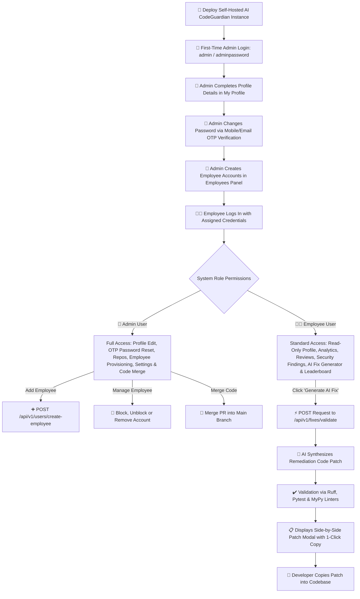

# AI CodeGuardian 🛡️
> **Open-Source Self-Hosted AI Pull Request Code Review & Security Platform**

**AI CodeGuardian** is an open-source, self-hosted automated code review and security assistant designed for enterprise engineering teams. Companies can pull the project, deploy it on their private servers, connect their own self-hosted or cloud **GitLab** instance, and maintain 100% data privacy over their source code.

---

## 💡 What is AI CodeGuardian? (The Simple Explanation)

When software developers write new features or fix bugs, they submit their code as a **Pull Request (PR)**. Before merging it into the live project, team members must manually inspect the code line-by-line to check for mistakes, security risks, or bad practices. 

This manual review process is often slow, tiring, and human reviewers can miss dangerous security flaws.

**AI CodeGuardian acts as an automated 24/7 code reviewer:**

1. **Automatic Inspection**: Every time a pull request is submitted, AI CodeGuardian scans the code changes instantly.
2. **Plain-English Feedback**: It flags dangerous security risks (like SQL injection vulnerabilities or unhandled crashes) with clear explanations.
3. **Automated Fix Generation**: Instead of just pointing out errors, it generates a verified code fix that developers can copy with 1 click.
4. **Team Analytics**: It gives engineering leads a clean visual dashboard showing project health, code quality scores, and developer rankings.

---

## 🔑 Authentication Architecture: Temporary Server Login & Profile Management

The registration page has been **completely removed**. Account provisioning follows a self-hosted enterprise workflow:

1. **First-Time Deployment Login**:
   - Upon initial server deployment, the System Administrator logs in using default temporary credentials:
     - **Default Username**: `admin`
     - **Default Password**: `adminpassword`
2. **Admin Profile Setup & OTP Password Change**:
   - On first login, Admin navigates to **"My Profile"** to enter and save their details (Full Name, Email, Mobile Number).
   - Admin can change their password anytime using **Email / Mobile Number OTP verification** (`POST /api/v1/users/change-password-otp`).
3. **Employee Account Provisioning**:
   - Employees **do not** self-register. The Admin creates employee accounts from the **Employees** panel ([`UserManagementView.jsx`](file:///home/mohit/Videos/AI%20CodeGuardian/frontend/src/views/UserManagementView.jsx)) by assigning an Employee Name, Email, Username, Password, and Mobile Number.
4. **Employee Profile View**:
   - Employees log in with their assigned credentials and view their read-only profile details in **"My Profile"** ([`ProfileView.jsx`](file:///home/mohit/Videos/AI%20CodeGuardian/frontend/src/views/ProfileView.jsx)). Only the Admin can update employee profile details and passwords.

---

## 🔐 Role Comparison: Admin vs Employee

| Platform Feature / Interface | 👑 Primary Admin User | 👨‍💻 Employee / Developer |
| :--- | :---: | :---: |
| **View Analytics, PR Reviews & Security Findings** | ✅ Full Access | ✅ Full Access |
| **Generate AI Fixes & Copy Code Patches** | ✅ Full Access | ✅ Full Access |
| **View Developer Leaderboard** | ✅ Full Access | ✅ Full Access |
| **Update Own Profile & Change Password via OTP** | ✅ **Full Admin Access** | 🔒 Read-Only Profile View |
| **Create Employee Accounts & Assign Passwords** | ✅ **Admin Exclusive** | 🔒 Restricted |
| **Manage Employees (Block, Unblock, Remove)** | ✅ **Admin Exclusive** | 🔒 Restricted |
| **Connect & Register New Repositories** | ✅ **Admin Exclusive** | 🔒 Restricted |
| **Merge Code Pull Requests to `main` Branch** | ✅ **Admin Exclusive** | 🔒 Restricted |
| **Configure System AI Settings & Strictness** | ✅ **Admin Exclusive** | 🔒 Restricted |

---

## 📊 Application WorkFlow Diagram (Flowchart)



---

## 🛠️ How to Set Up & Run Locally (Step-by-Step)

Follow these exact steps to set up and run the self-hosted project:

### Prerequisites
Make sure you have installed on your machine:
- **Python**: version 3.12 or higher
- **Node.js**: version 18.0 or higher
- **Git**

---

### Step 1: Clone the Repository & Configure Environment

```bash
git clone https://github.com/ManishPatidar806/AI-CodeGuardian.git
cd "AI CodeGuardian"
```

Create a `.env` file inside the `backend/` folder:

```ini
APP_NAME="AI CodeGuardian"
APP_VERSION="0.1.0"
APP_ENV="development"
DEBUG=true

HOST="0.0.0.0"
PORT=8000

POSTGRES_HOST="localhost"
POSTGRES_PORT=5433
POSTGRES_DB="codeguardian"
POSTGRES_USER="postgres"
POSTGRES_PASSWORD="postgres"

REDIS_HOST="localhost"
REDIS_PORT=6379

LOG_LEVEL="INFO"
GITLAB_URL="https://gitlab.com"
GEMINI_API_KEY="your_real_api_key_here"
```

---

### Step 2: Start the FastAPI Backend Server

```bash
cd backend
source .venv/bin/activate
python -m uvicorn app.main:app --host 0.0.0.0 --port 8000
```

*Backend server runs at `http://localhost:8000` (API docs at `http://localhost:8000/docs`).*

---

### Step 3: Start the React Web Dashboard

Open a **second terminal window**:

```bash
cd frontend
npm install
npm run dev
```

*Open your web browser and navigate to `http://localhost:3000`.*

---

## 📖 Step-by-Step User Guide & Account Walkthrough

### 👑 Admin Walkthrough
1. **First Login**: Log in at `http://localhost:3000` with default server credentials (`admin` / `adminpassword`).
2. **Profile & Password Setup**: Open **"My Profile"**, fill in your Full Name, Email, and Mobile Number, and click **"Save Admin Details"**. Click **"Send OTP"** to receive a 6-digit verification code and update your password.
3. **Employee Provisioning**: Go to **"Employees"** on the left sidebar and click **"+ Create Employee Account"**. Enter the employee's Name, Email, Username, Password, and Mobile Number ([`AddEmployeeModal.jsx`](file:///home/mohit/Videos/AI%20CodeGuardian/frontend/src/components/modals/AddEmployeeModal.jsx)).
4. **Account Controls**: In the **Employees** panel, Admin can **Block/Unblock** employee access or **Remove** user accounts (`PUT /api/v1/users/{id}/status`).
5. **Repository Connection & Merging**: Connect public repos (`POST /api/v1/repositories`) and execute **"Admin Merge to Main Branch"**.

### 👨‍💻 Employee Walkthrough
1. **Employee Login**: Log in with the **Username** and **Password** assigned by the System Administrator. Registration forms do not exist.
2. **View Profile**: Open **"My Profile"** ([`ProfileView.jsx`](file:///home/mohit/Videos/AI%20CodeGuardian/frontend/src/views/ProfileView.jsx)) to view your assigned profile details. Editing is restricted to the Admin.
3. **Dashboard & Analytics**: View project health metrics, scan turnaround speeds, and critical vulnerability counts.
4. **Generate AI Fixes**: Open **"Findings"**, click **"Generate AI Fix"**, and use the 1-click **"Copy Code Patch"** button.
5. **Leaderboard**: Track clean-code ratings, passed PR counts, and security badges.

---

## 💻 Tech Stack Used

- **Frontend**: React 18, Vite 5, Tailwind CSS v3, Lucide Icons
- **Backend**: FastAPI (Python 3.12), SQLAlchemy, Pydantic v2, Structlog, Uvicorn
- **Authentication & Management**: Temporary Credentials Login (`/api/v1/users/login`), Admin Profile Update (`/api/v1/users/{id}/profile`), OTP Password Reset (`/api/v1/users/change-password-otp`), Employee Provisioning (`/api/v1/users/create-employee`)
- **Testing**: Pytest (123/123 tests passed), Ruff, MyPy

---

## 📜 License

This project is open-source and licensed under the **MIT License**.
